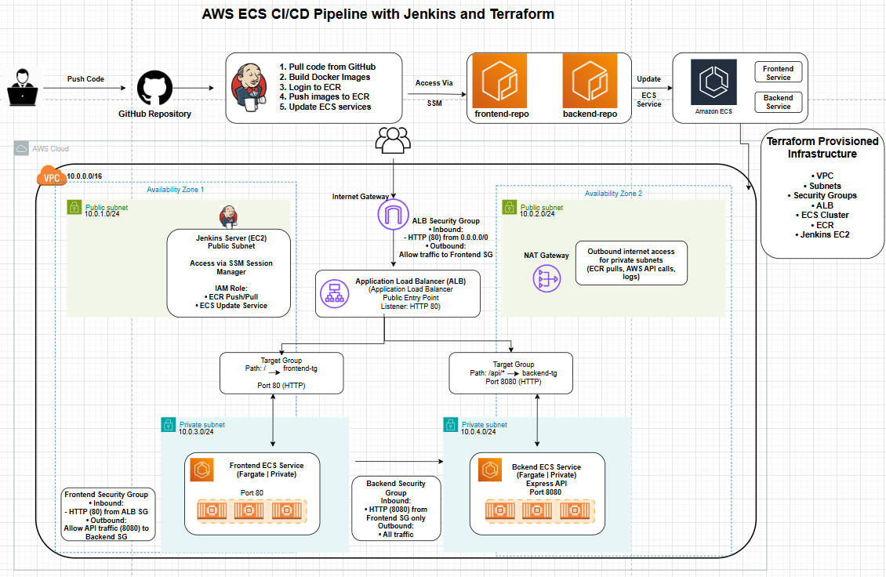

# TechPathway Challenge 2 – AWS ECS CI/CD Pipeline

## Overview

This project implements an end-to-end CI/CD pipeline for deploying a containerized full-stack application on AWS using Jenkins, Terraform, Amazon ECS (Fargate), and Amazon ECR.

The application consists of:
- React frontend
- Express backend

The deployment workflow is fully automated:
- Code push to GitHub triggers Jenkins pipeline via webhook
- Jenkins builds Docker images
- Images are pushed to Amazon ECR
- ECS services are updated automatically

---

## Architecture

High-level architecture includes:

- Jenkins on EC2 for CI/CD orchestration  
- Amazon ECR for container image storage  
- Amazon ECS (Fargate) for containerized workloads  
- Application Load Balancer for traffic routing  
- Terraform for infrastructure provisioning  

### Routing
- `/` → Frontend Service  
- `/api` → Backend Service  

---

## Tech Stack

### Cloud & Infrastructure
- AWS EC2
- AWS ECS Fargate
- AWS ECR
- AWS ALB
- AWS VPC
- AWS IAM

### DevOps
- Jenkins
- Terraform
- Docker
- GitHub Webhooks

### Application
- React
- Express
- Node.js
- Nginx

---

## CI/CD Pipeline

Pipeline stages:

- Checkout SCM
- Verify Files
- Build Frontend Image
- Build Backend Image
- Login to ECR
- Tag Images
- Push Images to ECR
- Deploy to ECS

---

## Documentation

Detailed project resources:

- [Project Documentation](./docs/project-documentation.pdf)

## Deployment Evidence

Screenshots of successful deployment are available in:

- [Screenshots Folder](./screenshots/)
---

## Key Highlights

- Infrastructure provisioned with Terraform  
- Secure networking with public/private subnets 
- Security groups enforce least-privilege access between services
- ECS workloads deployed in private subnets  
- Jenkins secured using AWS Session Manager (no SSH)  
- End-to-end automated deployment pipeline  

---

## Future Improvements

- HTTPS with ACM
- ECS Auto Scaling
- Remote Terraform state (S3 + DynamoDB)
- CloudWatch monitoring and alerts
- Multi-AZ ECS deployment for higher availability